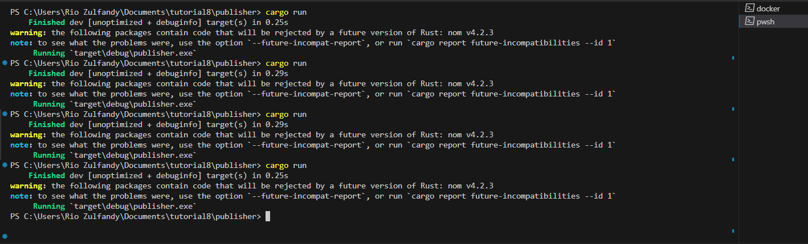
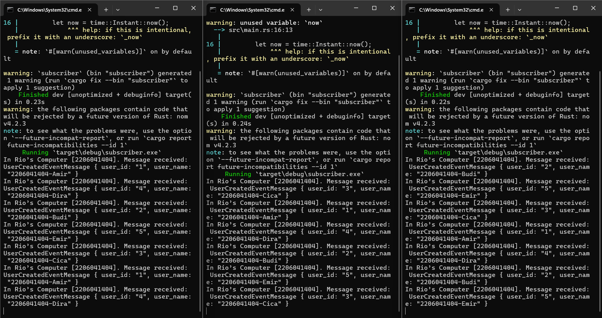
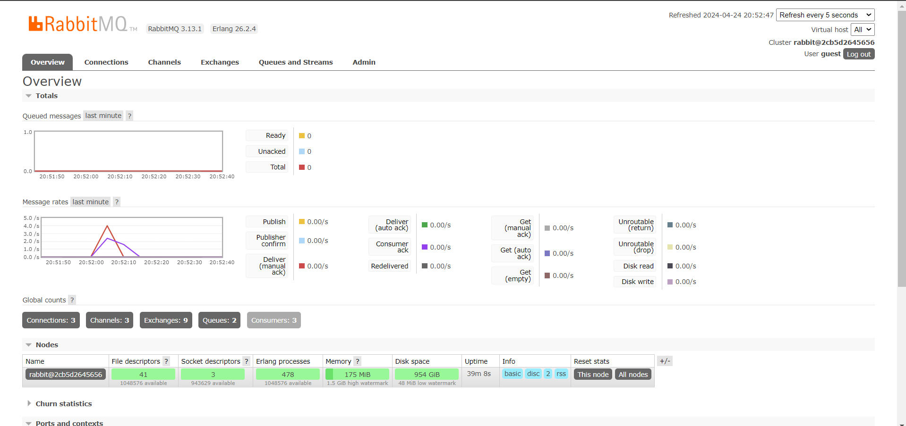

1.  what is amqp?

AMQP adalah singkatan dari Advanced Message Queuing Protocol. Ini adalah protokol lapisan aplikasi standar terbuka untuk middleware yang berorientasi pesan, yang dirancang untuk bertukar pesan antara aplikasi atau layanan dalam sistem terdistribusi. AMQP memungkinkan komunikasi antara sistem yang dapat terpisah, fleksibel, dan dapat diskalakan.

2. what it means? guest:guest@localhost:5672 , what is the first quest, and what is the second guest, and what is localhost:5672 is for? 

"guest" adalah nama pengguna.
"guest" (sekali lagi) adalah kata sandi.
"localhost:5672" mengacu pada nama host dan nomor port.

Dalam konfigurasi ini:

- "guest" adalah nama pengguna dan kata sandi default yang sering digunakan untuk tujuan pengujian atau pengaturan awal pada broker AMQP seperti RabbitMQ.

- "localhost" mengacu pada mesin lokal, menunjukkan bahwa broker AMQP berjalan pada mesin yang sama dengan klien.

- "5672" adalah nomor port default untuk komunikasi AMQP.

Jadi, "guest:guest@localhost:5672" mewakili kredensial (nama pengguna dan kata sandi) yang digunakan untuk terhubung ke broker AMQP lokal yang berjalan pada port 5672.

## Lampiran simulation slow subscriber

Berdasarkan lampiran di atas, terlihat terjadi akumulasi 11 pesan dalam antrean pada waktu tertentu. Hal ini disebabkan oleh penundaan dalam pemrosesan pesan oleh Subscriber yang tidak mampu menangani pesan secepat yang dikirim oleh Publisher. Situasi ini semakin diperparah dengan eksekusi berulang *cargo run* pada Publisher yang meningkatkan jumlah pesan yang diterima oleh Subscriber. Akibatnya, Subscriber menjadi terbebani karena harus memproses jumlah pesan yang besar secara bersamaan. Ketidakseimbangan antara kecepatan pengiriman pesan oleh Publisher dan kecepatan pemrosesan oleh Subscriber dapat mengakibatkan penumpukan pesan dalam antrean.

## Lampiran running 3 subscribers

Berdasarkan gambar di atas, terlihat bahwa penambahan jumlah Subscriber dapat mengurangi jumlah pesan yang tertunda dalam antrean. Dengan lebih banyak Subscriber, pemrosesan pesan bisa dilakukan secara paralel, sehingga beberapa Subscriber dapat bekerja secara bersamaan untuk memproses pesan yang masuk. Ini membantu mendistribusikan beban kerja dengan lebih merata dan meningkatkan kecepatan respons sistem terhadap pesan-pesan yang datang. Oleh karena itu, penambahan jumlah Subscriber membantu menjaga keseimbangan antara kecepatan pengiriman pesan oleh Publisher dan kecepatan pemrosesan oleh Subscriber, yang pada akhirnya mengurangi penumpukan pesan dalam antrean pesan (message queue).